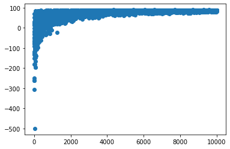
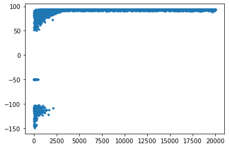
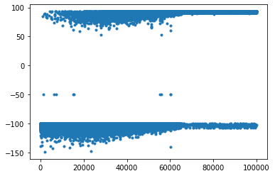

# RL-in-toy-environments

This projects consists of simple toy-worlds for RL agents that have been constructed from scratch. The RL agent will try each time to find the optimal strategy implementing various algorithms.
The 2D grid worlds allow for 4 discrete actions, while returning a reward that is chosen by the user at each instantiation of the problem.

We have constructed a custom grid world that can be configured to include a "simple" cliff, that is a cliff right next to the goal state or a more "complex" cliff which makes the goal state to be hidden behind it.
We also consider a custom initial state, but the goal state is always thought to be the bottom right corner of the grid world.

An example of a simple-cliff grid is as follows:

 While a more complex one is:
 

 Note that in the complex one we have the initial state at the left-top corner, while there is a cliff next to it as well as in front of it. The goal state (bottom-right) has a reward of +100 hidden behind a cliff.
 
 Using a SARSA trained agent, we can see that the simple problem without a cliff is solved very easily. (see the scores over time below)

Another example is that of a simple cliff. The initial state is the top left position of the grid and the final remains the bottom right.

and the solution scores within 20000 episodes (10 seconds of computation time) is:

We see that the problem is solved fairly easily. 
The values of each position in the grid is given below.

The last and most complex (out of the three) grids is shown below.

while the scores are:

and the corresponding values:

as expected it took a lot more episodes to solve the complex grid (starting top left), but was eventually a success.
