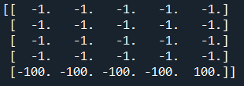
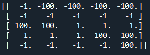

# RL-in-toy-environments

This projects consists of simple toy-worlds for RL agents that have been constructed from scratch. The RL agent will try each time to find the optimal strategy implementing various algorithms.
The 2D grid worlds allow for 4 discrete actions, while returning a reward that is chosen by the user at each instantiation of the problem.

We have constructed a custom grid world that can be configured to include a "simple" cliff, that is a cliff right next to the goal state or a more "complex" cliff which makes the goal state to be hidden behind it.
We also consider a custom initial state, but the goal state is always thought to be the bottom right corner of the grid world.

An example of a simple-cliff grid is as follows:

 While a more complex one is:
 

 Note that in the complex one we have the initial state at the left-top corner, while there is a cliff next to it as well as in front of it. The goal state (bottom-right) has a reward of +100 hidden behind a cliff.
