# RL-in-toy-environments

This projects consists of simple toy-worlds for RL agents that have been constructed from scratch. The RL agent will try each time to find the optimal strategy implementing various algorithms.
The 2D grid worlds allow for 4 discrete actions, while returning a reward that is chosen by the user at each instantiation of the problem.

We have constructed a custom grid world that can be configured to include a "simple" cliff, that is a cliff right next to the goal state or a more "complex" cliff which makes the goal state to be hidden behind it.
We also consider a custom initial state, but the goal state is always thought to be the bottom right corner of the grid world.

An example of a simple-cliff grid is as follows:

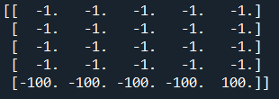

 While a more complex one is:
 
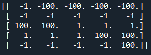

 Note that in the complex one we have the initial state at the left-top corner, while there is a cliff next to it as well as in front of it. The goal state (bottom-right) has a reward of +100 hidden behind a cliff.
 
 ## SARSA
 
 Using a SARSA trained agent, we can see that the simple problem without a cliff is solved very easily. (see the scores over episodes below)

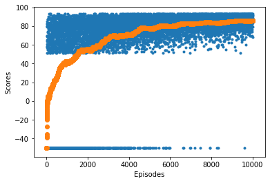

Another example is that of a simple cliff. The initial state is the top left position of the grid and the final remains the bottom right.

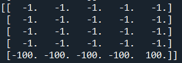

and the solution scores within 10000 episodes (less than 10 seconds of computation time) is shown below. The orange curve shows the average score accumulated over the last 4 episodes at each time.

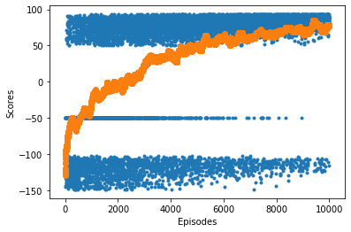

We see that the problem is solved fairly easily. 
The value of each position in the grid is given below.

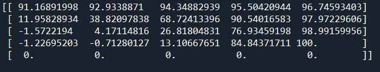

The last and most complex (out of the three) grids is shown below.

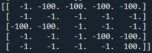

while the scores are:

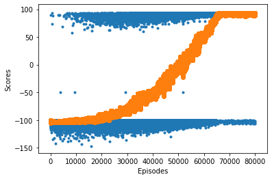

and the corresponding values:

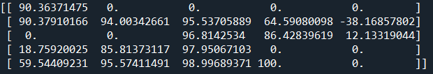

as expected it took a lot more episodes to solve the complex grid (starting top left), but was eventually a success.

### A few words about the implementation:
For detailed description on the implementation, check the code comments. However, just to give an overview we will discuss here some key points of the implementation.

1) The agent is an instance of a class. We use a dictionary as our data structure that keeps the values for the actions (Q-table). Each state is a key in the dictionary and the corresponding value is a list of length equal to the number of possible actions. At first the agent knows nothing about the structure of the environment (other than it is 2D, so that each key in the table is a 2-tuple). While the currently visited state is not in the dictionary, we add the entry and initialise the value to a 1D array of zeros. The agent can choose an action and update its table of values.

2) The environment is simply a 2D grid (created as a numpy array in gridworld.py). The class has functions that allow it to be created, reset and return rewards to the agent so that the update can be done after a transition. It accepts as parameters the size of the grid, the initial and goal state, as well as the rewards of each position according to whether it is a simple step, a cliff or the goal. There is also a provision to configure the cliff as simple or complex.

3) The experiment run just consists of two loops. One loop for the number of episodes and an inner loop that keeps on running until we reach a terminal state or the maximum number of steps for the episode (hyperparameter)

## Q-Learning
With a slight modification to the way the actions are chosen in the SARSA algorithm, we implement what is known as Q-learning (aka SARSA-max). The idea is that instead of using an epsilon greedy policy for the action selction, we always select the one that maximizes the Q value for a given state (that is we are completely greedy). For the specific problem as we can see below, we achieve a solution a lot faster for the grid with the complex cliff!

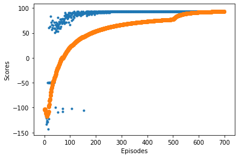

And the Q table is as follows:

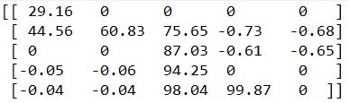

## Monte Carlo

The Monte Carlo method is a method that needs no prior knowledge of the environment.
